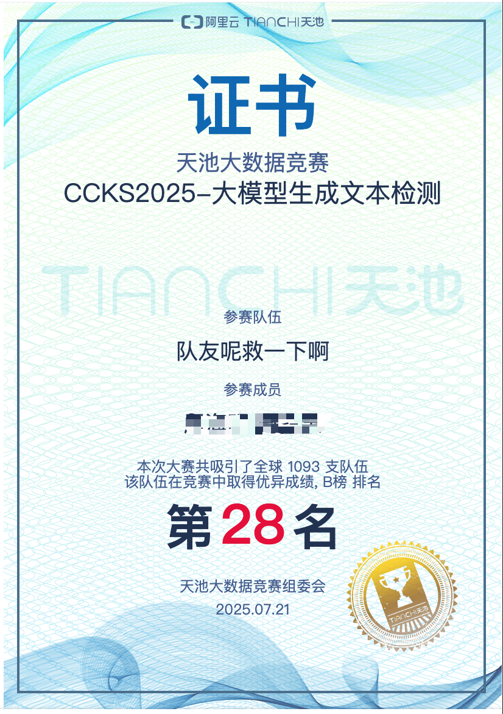

# CCKS2025 大模型生成文本检测 - Qwen7B-QLORA

## 项目概述

这是一个针对CCKS2025竞赛的项目，专注于检测大模型生成的文本。项目使用Qwen2.5-7B-Instruct模型的QLORA（Quantized Low-Rank Adaptation）微调版本进行训练和推理。主要组件包括数据处理、模型训练、测试推理，以及数据分析和可视化。

**CCKS2025-大模型生成文本检测**竞赛比赛成绩：**B 榜第28名**



### 项目结构
- **data/**: 包含训练集（train.jsonl）、测试集（test.jsonl）、原始数据（*.pkl）和分析图表（analysis/目录下）。
- **model/**: 存储微调后的模型文件，如Qwen2.5-7B-Instruct-QLoRA。
- **data_processor.py**: 数据分析、清洗、重复检测和可视化脚本。
- **train.py**: 模型训练脚本，支持数据增强（如同义词替换、随机删除、交换）和分布式训练。
- **run_test.py**: 测试推理脚本，加载模型并生成预测结果。
- **requirements.txt**: 项目依赖列表。
- **architecture.md**: 系统架构描述。
- **.gitignore**: Git忽略文件。
- **submit.txt**: 可能用于提交结果。

## 安装

1. 克隆仓库：
   ```
   git clone <repository-url>
   cd CCKS2025-大模型生成文本检测-qwen7b-qlora
   ```

2. 创建虚拟环境（推荐使用Python 3.8+）：
   ```
   python -m venv venv
   source venv/bin/activate
   ```
torch==2.3.0
cuda=12.1

3. 安装依赖：
   ```
   pip install -r requirements.txt
   ```
   注意：项目依赖torch、transformers、peft等库，确保CUDA可用以支持GPU训练。

## 用法

### 1. 数据处理
运行数据处理器来分析和清洗数据：
```
python data_processor.py
```
这将加载train.jsonl和test.jsonl，生成长度分布、标签分布图，并清洗数据。

数据切割，切割掉开头结尾 1000 条数据，再取其中前 8000 条数据作为训练集

### 2. 模型训练
运行训练脚本：
```
python train.py
```
- 模型为Qwen2.5-7B-Instruct。
- 支持数据增强（如同义词替换）。
- 使用LoRA配置微调Qwen模型。
- 保存模型到model/目录。
- 使用8 位LoRA量化。
- r=16、lora_alpha=32、lora_dropout=0.05、num_train_epochs=3、learning_rate=1e-4、weight_decay=0.001、warmup_ratio=0.05。

### 3. 测试和推理
运行测试脚本：
```
python run_test.py
```
- 加载微调模型。
- 对测试数据进行预测。
- 保存结果到submit.txt。

## 架构概述

参考architecture.md的详细描述：
- **数据处理模块**：加载、清洗、分析数据。
- **模型架构**：基于Qwen2.5-7B-Instruct的QLORA微调。
- **训练配置**：使用torch和transformers，支持分布式训练。
- **推理流程**：提示工程用于文本分类。

### 优势
- 高效的LORA微调减少资源消耗。
- 数据增强提升模型鲁棒性。

### 限制
- 需要GPU资源。
- 数据质量影响性能。