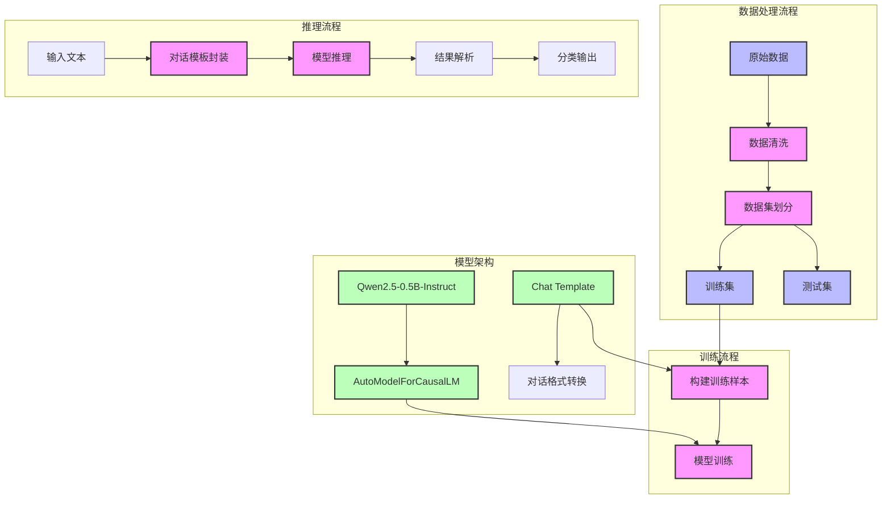

# AI文本检测系统架构设计

## 系统架构图



## 关键组件说明

### 1. 数据处理模块
- **数据清洗**：
  - 去除重复文本
  - 过滤长度（10-1000字符）
  - 保持标签分布平衡
- **数据划分**：
  - 训练集：22400条（80%）
  - 测试集：5600条（20%）

### 2. 模型架构
- **基础模型**：Qwen2.5-0.5B-Instruct
- **模型类型**：AutoModelForCausalLM（因果语言模型）
- **输入格式**：对话模板
  ```python
  {
      'role': 'system', 
      'content': '助手角色定义...'
  },
  {
      'role': 'user',
      'content': '待检测文本'
  },
  {
      'role': 'assistant',
      'content': '分类结果'
  }
  ```

### 3. 训练配置
- 学习率：2e-5
- 训练轮次：10
- 批次大小：2
- 梯度累积步数：4
- 优化器：AdamW

### 4. 推理流程
1. 文本输入
2. 对话模板封装
3. 模型生成
4. 结果提取与输出

## 优势与限制

### 优势
1. 充分利用预训练模型知识
2. 任务形式自然，易于扩展
3. 保持模型生成能力

### 限制
1. 推理速度相对较慢
2. 资源消耗较大
3. 输出稳定性需要控制